# P2: Ideation and Lo-fi Prototypes

## Video Prototype

[YouTube Video](https://youtu.be/y0EWoYUR3UY)

In this video, we step through the interaction of registering for a class at a recreation centre. The user navigates to the hockey section, selects the class at the time he/she wants to take it at, fills in some personal info and registers. After an alert shows they have registered, they navigate back to “My Zone” to view the class they have been enrolled in.

## Storyboard

Based on our design methods; survey, rapid ethnography, and secondary source, we created our storyboard. It fulfills the three most important tasks users need to be able to do in the App. That is, registering/ viewing current classes, equipment rental, and how busy each faculty is.  

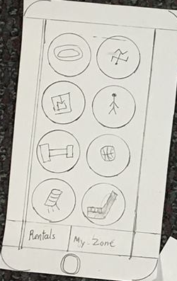

After opening the App, the user will see a main menu that includes all Recreation centre activities displayed as circular tiles. On this main page, there is also a  “My Zone” button, and a “Rentals” button. This design makes it very simple to check the classes, busy hours of the facilities and the rentals because it only requires a few steps to see what you are looking for. 

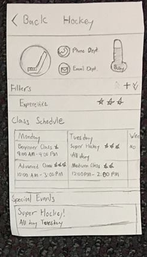

After selecting an activity on the main menu, the user is brought to another page that shows how busy the facility is, the class schedule, and special events that are currently going on for that activity. A user can select a class that suits them, and they will be forwarded to a page that includes the program information and fields to register. 

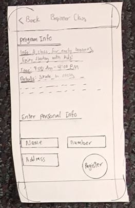

On this registration page, they fill in fields like their name and address and can push the “Register” button to enroll in the specified class.

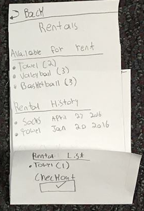

In the “Rentals” view, the user will be forwarded to a second page that contains available items for rent and rental history. A user can select the item that she wants to rent to be added to her rentals list and checkout button to confirm the selected item.

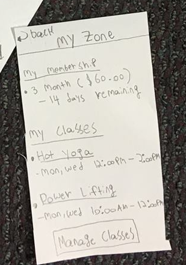

In the “My Zone” view, a user can see their current membership period and expiration date, classes they’re enrolled in, and the manage classes button.  All these pages have a back arrow to return to the previous view.

## Task-Centered System Walkthrough

We chose the task to register for a class at the recreation centre as the one to cover. This is a common activity for such an app, described in several of our Tasks from P1. For this walkthrough, we'll step through how to register for a Beginner Hockey class.
In specific: Register for a beginner Hockey Class at 9:00 AM, and then confirm it has been added to their schedule.

Task Step | Knowledgeable? | Motivated? | Believable? | Comments/suggested fixes 
--- | --- | --- | --- | --- 
Select the Hockey Tile | If they’re familiar with playing hockey, they would know what a stick looks like. They may not know what view the icon bring them to, but it will probably be closer to their goal. | Yes | Yes | Instead of a hockey stick icon, use a skate or a photograph of the rink. There are other activities that happen on the rink. 
Scroll Up/Down on the Class Schedule List to find “Beginner Class” at 9:00 Am. | This requires knowledge about common interface elements such as lists. | Yes, classes are under the “Class Schedule” header. | Yes | Empty
Tap on “Beginner Class” at 9:00 AM | The time and name of the class are displayed. | Maybe, the cell containing the class in the list must look like something that can be pushed. | Maybe  | The cell in the class schedule needs to look like a button, otherwise the user may not tap on it.
Tap and enter details into the “Name”, “Number”, and “Address” fields. | Yes. These are common items needed when registering for a class. If they’ve done it before, they should know this is a requirement. | Maybe. While the fields are above the “Register” button, a label should be on this page asking them to enter their information. | Yes | If a user presses “Register” before filling in the details, make the fields red and display a popup requesting they enter their information.
Push “Register” | Yes. This is an appropriate button name. | Yes. | Yes. | Empty
Push “Ok” on the registration confirmation. | Yes. It’s a common prompt. | Yes. | Yes. | Empty
Push “Back” to return to the main menu. | Yes. This is a common interface on Android and iOS. | Maybe. At this point, they’re wanting to confirm they’re in this class, and that it’s in their schedule. If they recall the main menu has the “My Zone” button to view their classes, this interaction would be motivated. | Yes. | Maybe have the confirmation dialog point to “My Zone” instead.
Push “My Zone” to display the enrolled class list | Yes. This is a common interface on Android and iOS. | Maybe. They would have to know their enrolled class list is under “My Zone”. The name implies it, but it isn’t direct. | Yes. | Consider revising the name to “My Activities” or something along those lines.

## Brainstorm and Affinity Diagram

To brainstorm, we first sketched out some ideas of what the overall system could look like. We did this on many slips of scrap paper as a group. These ideas were initially pretty wild. For example, one of the ideas was a system where users could sign up for courses via. drone. Another was a system where users would talk to a virtual assistant. However, a fair number of them ended up being interfaces for phones and websites.  After this phase, we reconvened and filtered out the ones that were more feasible to be implemented using current technology. Most of our sketches ended up being primarily focused on designs for web browsers and phone apps. After this, using the research techniques we performed in P1, we focused on three major tasks the users wanted the most. 
 
1. The ability to register/view/unregister from classes
2. The ability to view how busy the facilities currently were
3. The ability to rent equipment.
 
We then grouped our ideas into several categories by creating an affinity diagram.

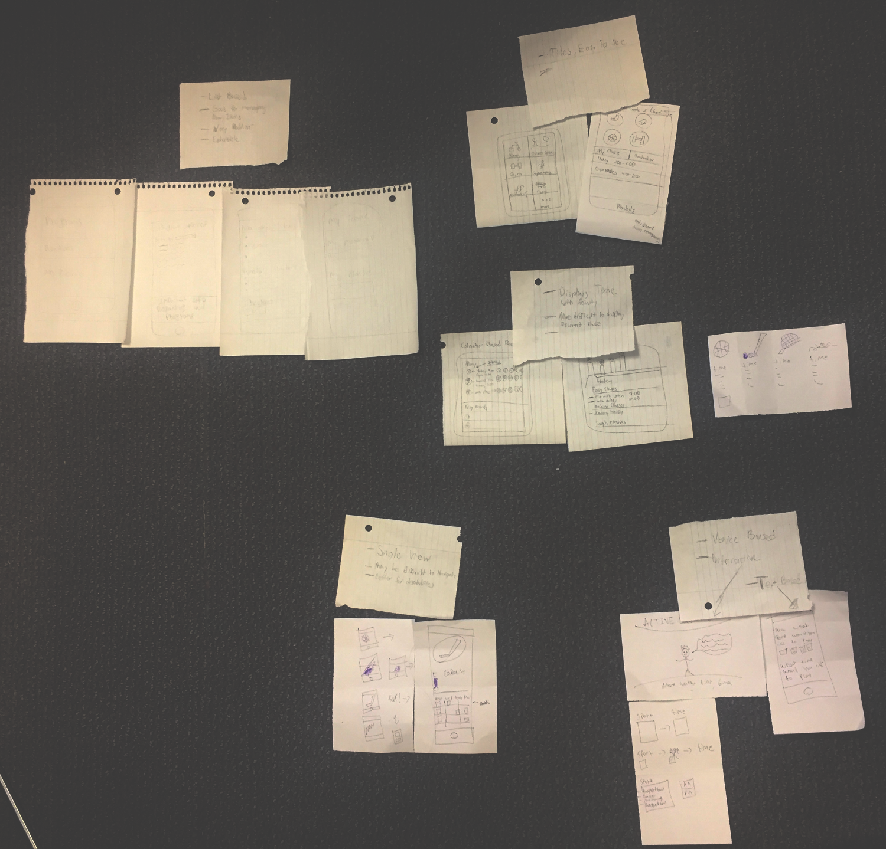
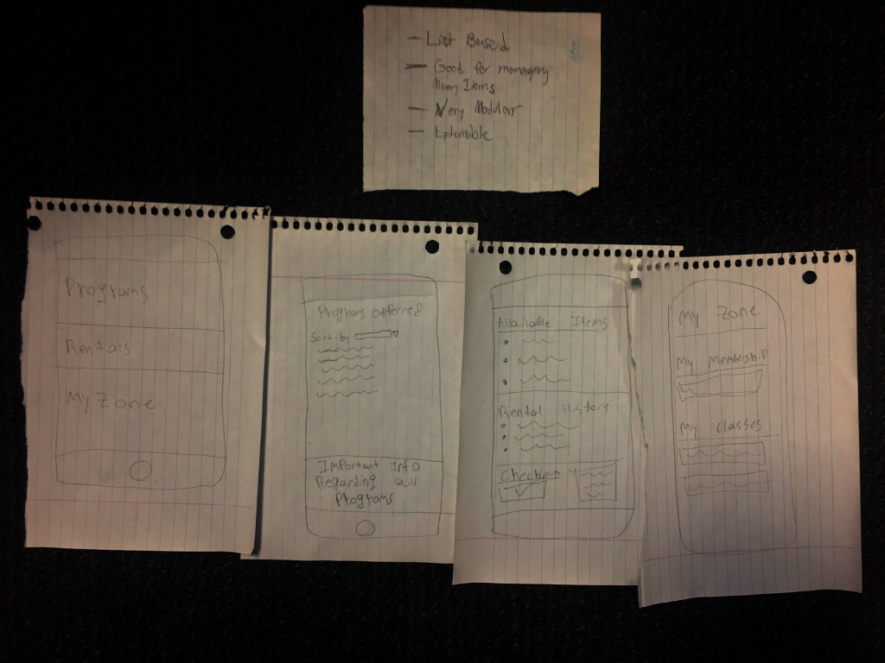

Our idea grouping ended up being:
* List based Interfaces
    * Designs that use a list buttons to access lists to display information.
* Tile interfaces
    * Interfaces that split up the faculties into different visible tiles, much like current recreation centre websites.
* Time centric interfaces 
    * Interfaces that show a timeline or a calendar view as the central control
* Single Item views
    * Interfaces that only show one item at a time, requiring swipes to navigate.
* ...and voice/text game based UI’s
    * Interfaces controlled by talking to a on screen character/representative, by either taking voice or text commands. 

Overall, this brainstorming process led us to realize many possibilities for the design of our project. Some designs show a lot more information, but trade off simplicity. On the other hand, some designs are very simple, but would be frustrating to navigate. For our user group, we feel the key Idea is to strike some sort of balance, and this iterative process really helped us narrow down possible designs that were good for this. By the number of ideas we ended up generating, we often discussed what we liked/disliked about each one, and this helped us narrow down on which designs to include in our storyboard.

After filtering our ideas down using the affinity diagram, we settled on three designs for the front page of our app.

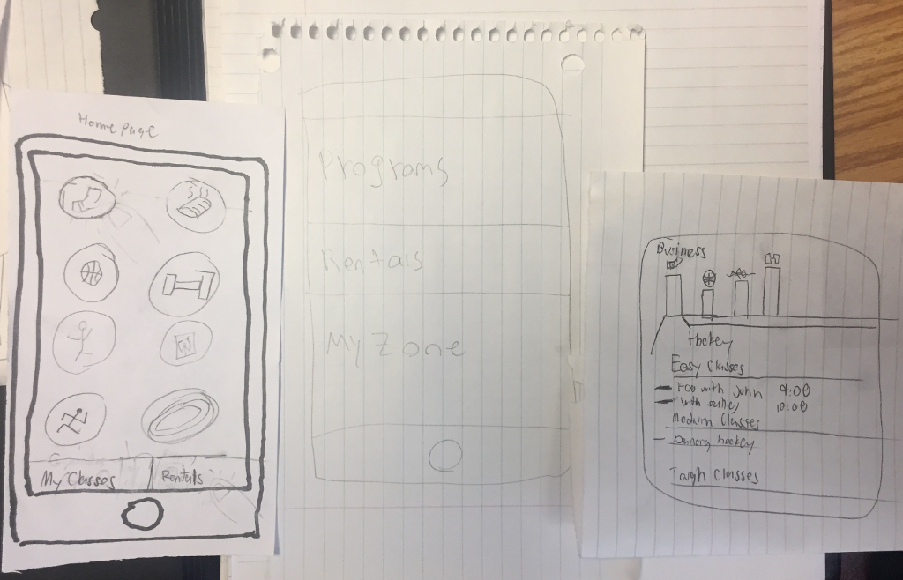

Idea 1:

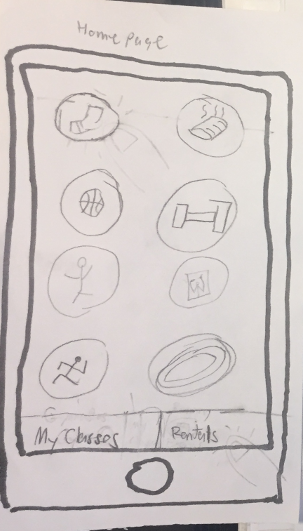

This interface is reminiscent the tile-based interaction currently on the University Of Calgary’s Active Living website. Each icon is of a major activity at the recreation centre. Tapping on one of these tiles brings the users to the activity specific page. On this new page, we would have how busy the area currently is, along with available programs and current events.

On the bottom of this main page, users can press “My Classes/My Zone” to view their current classes and rentals. They can also push Rentals to view and rent items to be picked up from the front on their arrival.

Idea 2:

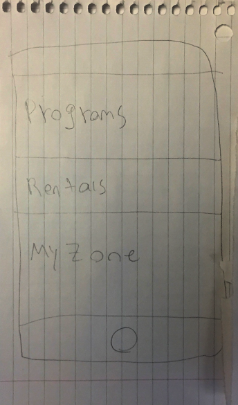

This design is very list based, and features large simple buttons. Pressing the large “Programs” button brings the user to a list of available programs. Pressing rentals, or “My Zone” would also bring the user to those respective lists. This design might be better suited for users with disabilities. Namely Cerebral palsy or Blindness, where simple interfaces with dictation would hopefully make it easier to use.

Idea 3:

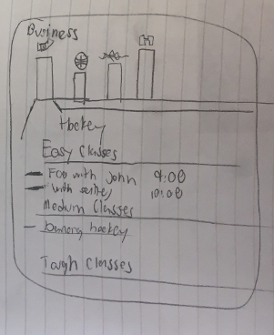

At the expense of simplicity, this design for the main menu displays more information. At the top is a side-scrollable bar chart of activities at the recreation centre. The bar chart displays how busy the respective faculty housing the activity is. By selecting an activity in this bar chart, users can see the current classes and events in that faculty. This design doesn’t provide a way to view current classes and rentals, but these could be added as buttons on the bottom.

## Reflection

During the ideation process, our group produced a wide variety of designs for our interface. Each of these designs were fundamentally different from one another. In the first phase we had the idea for a voice-based interface where the user would vocally communicate signing up for courses and renting equipment. However upon further consideration we understood that this task would be easier to the complete with a few taps on a different interface. 

A result from the first phase of ideation was that we learned what steps to take in order make our interface easy and intuitive to use. In the next phase of our ideation process we decided on a new design. This design would be intuitive for a much wider range of demographics, it would also only require a few taps on the screen to complete all the tasks our system is designed to do. This design would have thumbnails on the homepage for each facility at the recreation centre. By tapping onto an activity you can easily sign up for programs in that sport.

In retrospect of our ideation process there were numerous things that worked well. Yet, there was some aspects that did not translate how we wanted to. One of the aspects that worked well in our ideation process was all of our initial designs were very different from each other. We had a voice based design as mentioned above, also we had another design which showed information regarding all activities on the homepage. This gave us an opportunity to compare and contrast the designs with each other. An aspect of our process which we could have done differently was to keep in mind how we want our product to be used and who will it be used by. This was a new challenge we haven't come across. Often times we just worry about functionality, but if the design is not done well then the functionality will never be tested. 
