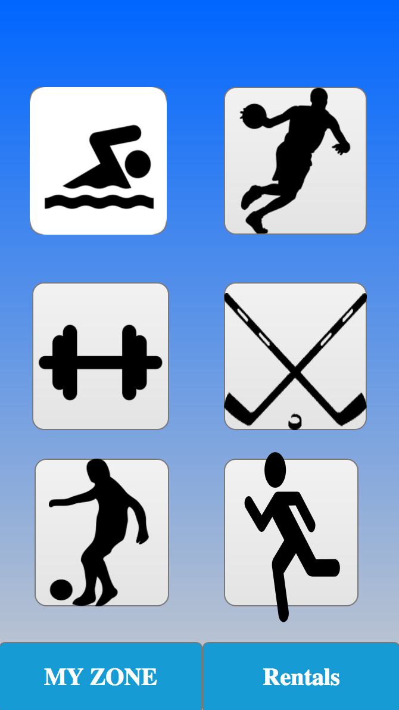
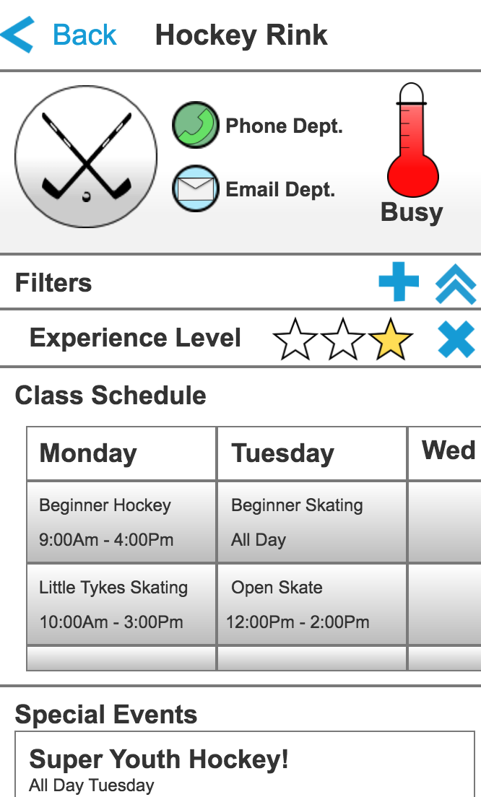
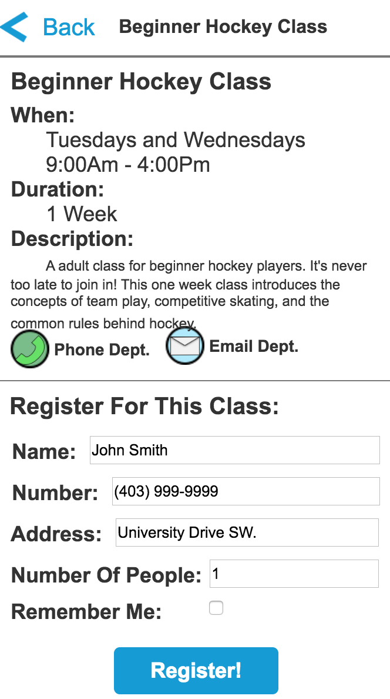
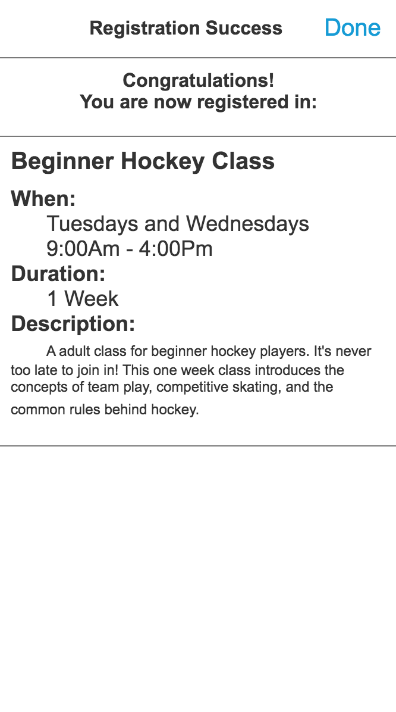
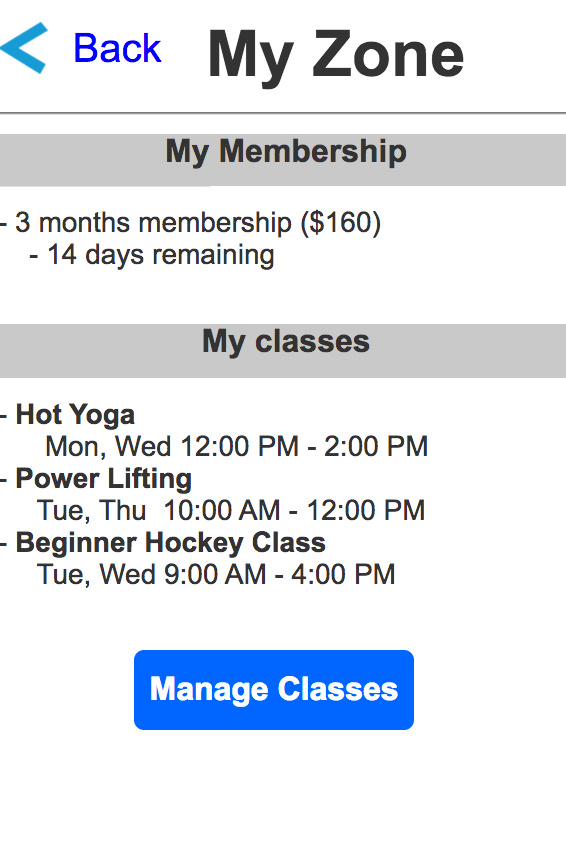
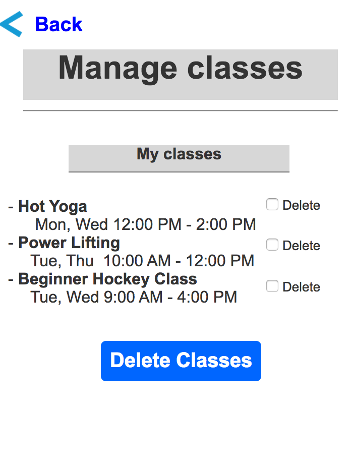
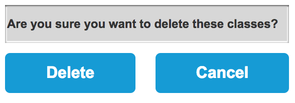
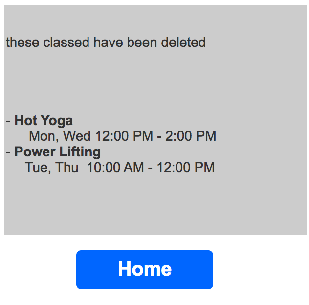
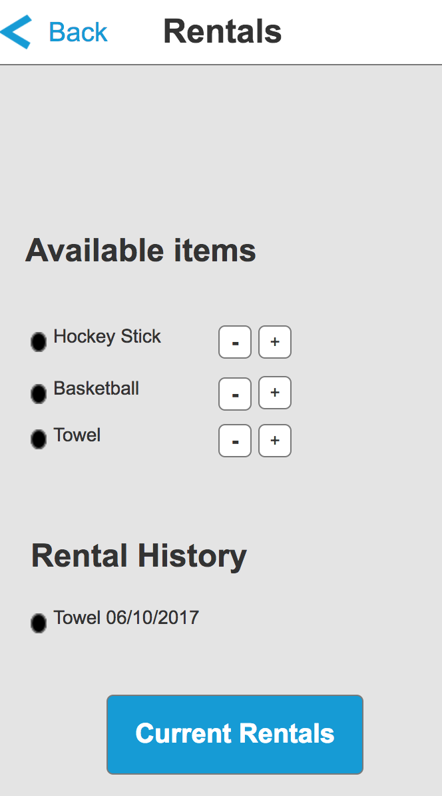
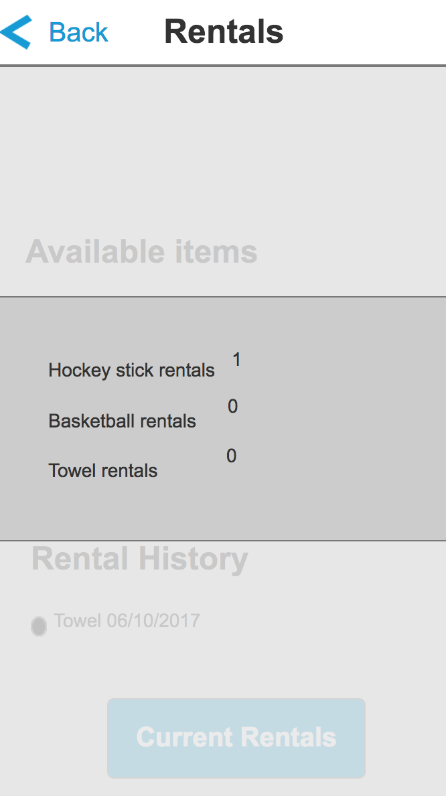

# P3: Hi-fi Prototypes and Heuristic Evaluation

## Link to Demo System

[System Demo](http://md9nb0.axshare.com/)

## Highlight Walkthrough

Our project was to design an app for recreation centres that makes the lives of both users and administrators easier. From our user studies and analysis in P1 and P2, we focused on three main tasks:
 
1. The ability to view how busy each faculty at the recreation centre is.
2. The ability to register/view/unregister from classes.
3. The ability to rent/view currently rented equipment.
 
We have designed our vertical prototype to be capable of doing each one of these tasks.
 
1.  **Viewing how busy a faculty is at the recreation centre:**

Users first locate the icon of the activity that they wish to do. For instance, if they are interested in playing hockey or skating, they would push the black hockey sticks on the main page. Upon pressing the button, they are taken to the Faculty Page. We decided to use black icons of activities over images of the facilities because we felt they would be more recognizable to newcomers who haven’t seen the facilities before. 

On the Faculty Page, they can see how busy a faculty is by looking at the red thermometer indicator. In this example, the hockey rink is very crowded. We went with the thermometer instead of a number to help simplify the estimation on how crowded the faculty is, and to obfuscate the number of people for security.
 
2.  **Registering, viewing and unregistering from classes at the recreation centre.**
	
**_Registering for a Class:_**

To register for a class at the recreation centre, users first locate the faculty the class falls under on the Main Page. For instance, they are interested in playing beginner hockey, they would select the black hockey sticks to view the Hockey Faculty Page. 
 

 
On the Hockey Faculty Page, they can view a live class schedule. To help limit what classes are displayed, we offer the ability to choose filters to isolate important classes. For instance, if they are looking for a beginner hockey class, they can add a experience filter, and set the experience rating to one star. Tapping on any one of the classes in the schedule will bring up a Class Detail Page which allows them to register in the class. 

On the class detail page, the user enters their relevant information and can press “Register” to register in the class. If their information is invalid, red text or a popup would appear and let them know what needs to be fixed. If all their information is good, the app will bring them to the Registration Success Page.
 
 
 
After pressing done, it will bring the user back to the Faculty Page.
 
**_Viewing current classes:_**

Viewing current classes is done on the MyZone Page. In the MyZone Page, the user can view and unregister in their current classes. To get to this page, the user presses the MyZone Button from the Home Page. 

 
Once in the MyZone Page, the user can see their current classes, the times they are at, and their current membership. 

**_Unregistering from a class:_**

To Unregister from Classes,the user can use the "Manage Classes" button. Pressing this button brings them to the Manage Classes Page. 
 

 
On the managing classes page, a user can select the classes they want to get rid of and then press “Delete Classes” to fully unregister. Just in case the user isn’t paying attention, the user gets a dialog on whether to Delete or Cancel the action. 
  

By pressing “Delete” button, the user will see a page that displays a confirmation message.If the user presses “Cancel” the user will go back to the Manage Classes Page. 
 

Once the classes have been deleted, the user can press the Home Button to return the the Main Page.

3. **Renting/viewing currently rented equipment**

One of the tasks our system was designed to carry out was the ability to rent items and to view current rentals. This functionality is handled by our Rentals Page. Here we are displayed a list of items that are available for rent, in this view we can click on the plus button to increase the count of a rented item. Once we have clicked the plus button this registers that an item is requested for rental. We can then click on current rentals to bring up a pop-up window to display our current rentals.

 In addition we can close the pop-up window and then 
continue to rent more items or rent less items.

## Heuristic Evaluation Results

The heuristic evaluation that we conducted revealed a lot of issues and concerns about our project that we had not realized before the evaluation. Of these issues some we viewed to be severe and needed improvement, while some of the issues were less catastrophic they still needed to be addressed. The set of major issues we identified consisted of three elements. The first design issue is how the user interacts with the rentals page. For example  when he or she wants to rent a towel there is no feedback to notify them that their request was processed. This violates one of the main principles of a good design; giving the user some kind of feedback or satisfaction when using the interface. Another major issue was the faculty view. This view holds far too much information. The user will most likely be overwhelmed by the amount of content on the page. While we agree that the information we have is important, we need to manage a way to present the content in a cleaner fashion. Whether that be spreading the information more on a single view or break it up into one or more views. Our last major problem with the interface was the process of registering for classes. While the flow of the task is clear and logical there is lots of room for the user to make a mistake, particularly the case of overlapping classes. To potentially circumvent this we may consider adding a calendar view which shows the classes currently enrolled so the user can make a more informed choice and reduce their chance of error when signing up for a class.

Aside from the major errors in our interface there are still many other issues regarding the system For example our system does not have any help or documentation that the user can access. This violates the “Help and documentation” heuristic. We rated this a 2 since it does not hinder the functionality of the system,but it is an aspect that we cannot go without.  We could argue that the interface is easy to interact with, yet as we have learned  the user is not like us and they will run into difficulties. To handle such events we must provide documentation that can guide a user through a task a. Another issue that we would look to fix in another iteration is the fact that we are able to rent items in two different views with slightly different functionality. This violates the “Consistency and Standards” heuristic, and we rated this as a 3.For example we can chose to increase the count of rented items and decrease the count of rented items in the rentals view. In addition the user is able to see rentals across all faculties(IE. Hockey stick, basketball). This rentals view offers the full functionality regarding rentals. Yet in our faculty view we are only able to increase the count of a rented item, and also the user is only able to view a subset of the total rented items that pertain to that particular sport. This redundancy and inconsistency is an error that we would like to fix by keeping the renting functionality contained within one single view.

## Raw Heuristic Evaluation Notes

[Individual Notes and List Of Issues](Images/P3/HeuristicEvaluationDocument.pdf "Raw heuristic evaluation notes")
